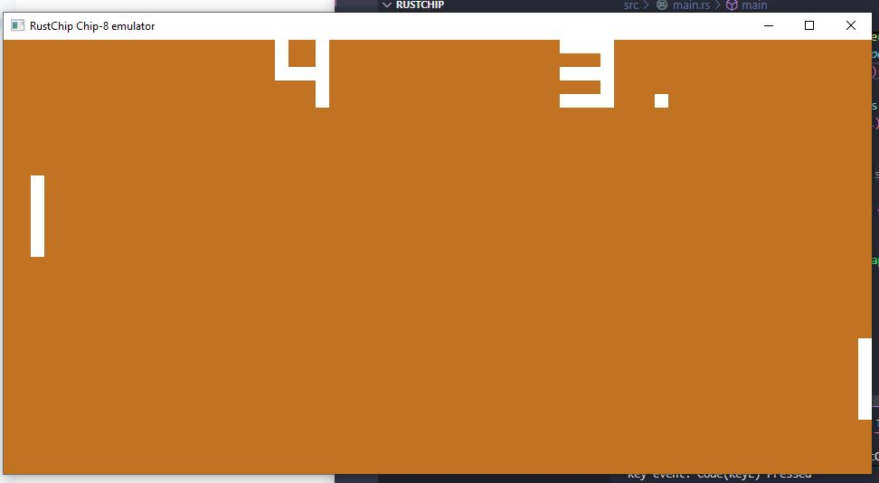
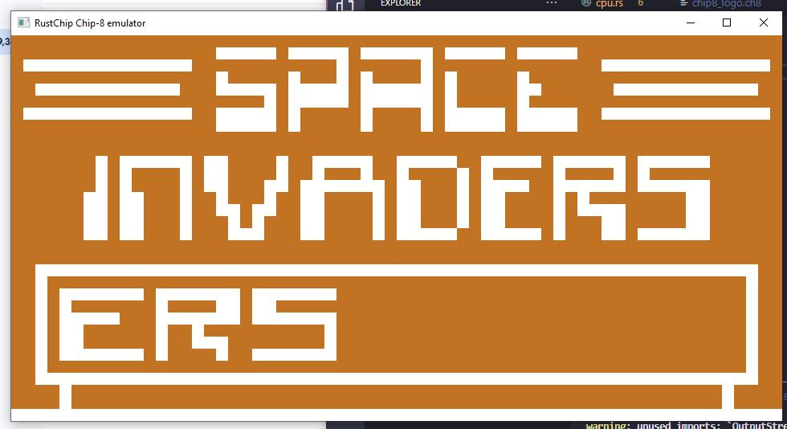

# RustChip - Chip-8 Emulator in Rust

RustChip is a simple Chip-8 emulator written in Rust, capable of running classic Chip-8 games such as Pong. It features a 64×32 monochrome display, a 16-key keypad, and a fully implemented Chip-8 CPU with timers.

---

## Features

- Full Chip-8 instruction set
- 64×32 two-color display
- 16-key input handling
- ROM loading
- Cross-platform via Rust and winit/pixels

---

## Screenshots





---

## Requirements

- Rust (latest stable)
- `cargo` build system
- `winit` and `pixels` crates (already included in `Cargo.toml`)

---

## Building and Running

Clone the repository:

```bash
git clone https://github.com/IRO05/RustChip.git
cd RustChip
```

Build the project:

```bash
cargo build --release
```

Run the emulator (default game pong):

```bash
cargo run --release
```

Run the emulator with other roms:

```bash
cargo run --release your_rom.ch8
```

---

## Controls

Input Map:

```bash
1 2 3 4  -> 1 2 3 C
Q W E R  -> 4 5 6 D
A S D F  -> 7 8 9 E
Z X C V  -> A 0 B F
```

---

## Emulator Architecture

1. **CPU (`cpu.rs`)**
   - Implements the Chip-8 CPU, including registers, program counter, stack, and timers.
   - Handles execution of instructions and manages delay and sound timers.

2. **Memory (`memory.rs`)**
   - Manages 4KB of RAM.
   - Preloads the Chip-8 fontset.
   - Provides functions to read/write bytes and 16-bit values.

3. **Display (`display.rs`)**
   - Represents the 64×32 monochrome screen.
   - Provides functions to set, flip, and clear pixels.
   - Keeps track of whether the display needs to be updated.

4. **Keypad (`keypad.rs`)**
   - Tracks the state of 16 input keys.
   - Provides press/release handling and a blocking wait for key press.

The `main.rs` file orchestrates everything: sets up the window, links the CPU, display, and keypad via `Arc<Mutex<>>`, starts the CPU thread, and handles rendering and user input.

---

## License

MIT License

Copyright (c) 2025 Isaac Robinson

Permission is hereby granted, free of charge, to any person obtaining a copy
of this software and associated documentation files (the "Software"), to deal
in the Software without restriction, including without limitation the rights
to use, copy, modify, merge, publish, distribute, sublicense, and/or sell
copies of the Software, and to permit persons to whom the Software is
furnished to do so, subject to the following conditions:

The above copyright notice and this permission notice shall be included in all
copies or substantial portions of the Software.

THE SOFTWARE IS PROVIDED "AS IS", WITHOUT WARRANTY OF ANY KIND, EXPRESS OR
IMPLIED, INCLUDING BUT NOT LIMITED TO THE WARRANTIES OF MERCHANTABILITY,
FITNESS FOR A PARTICULAR PURPOSE AND NONINFRINGEMENT. IN NO EVENT SHALL THE
AUTHORS OR COPYRIGHT HOLDERS BE LIABLE FOR ANY CLAIM, DAMAGES OR OTHER
LIABILITY, WHETHER IN AN ACTION OF CONTRACT, TORT OR OTHERWISE, ARISING FROM,
OUT OF OR IN CONNECTION WITH THE SOFTWARE OR THE USE OR OTHER DEALINGS IN THE
SOFTWARE.

---
